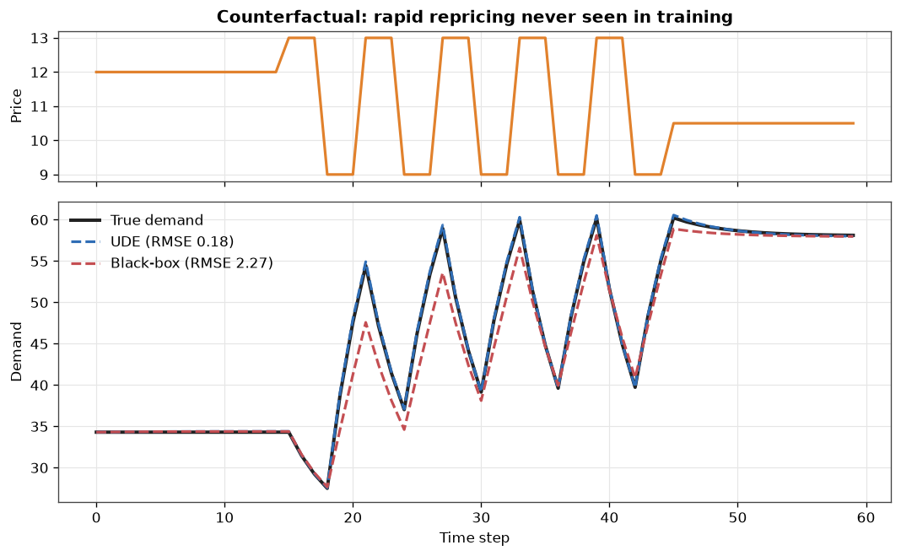
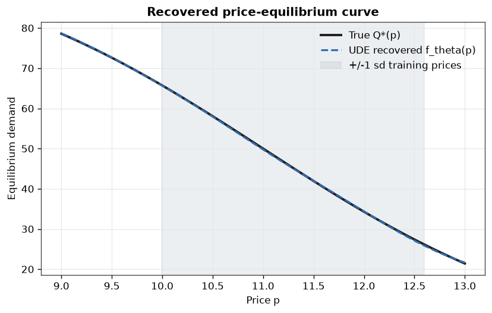
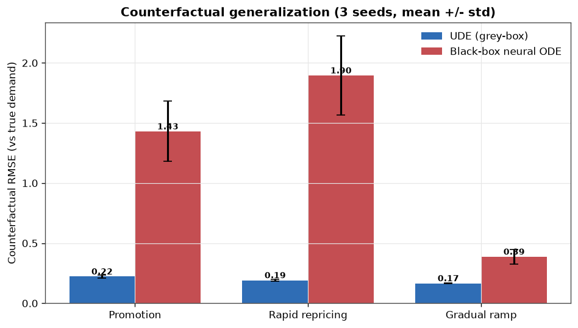
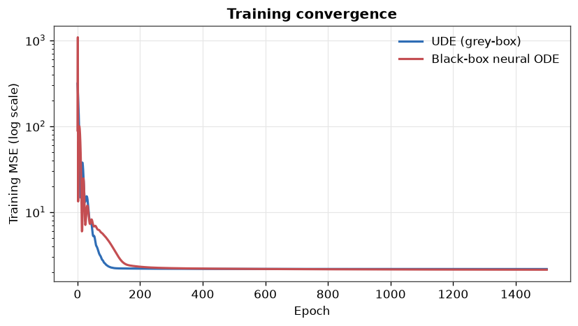
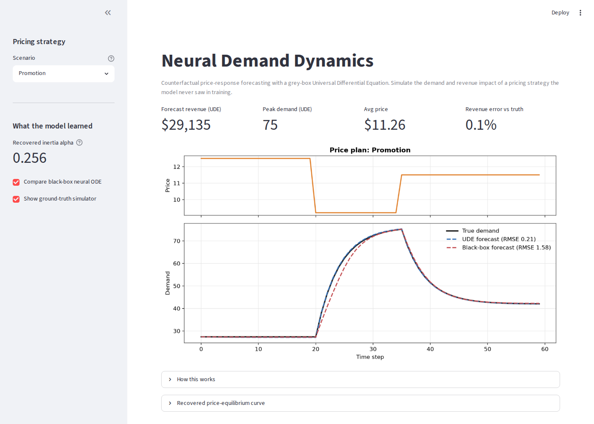
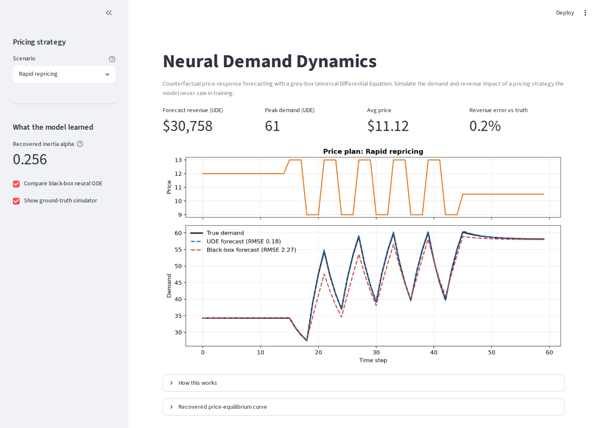

# Neural Demand Dynamics

Forecast the demand and revenue impact of a pricing strategy you have never run, by learning the *governing dynamics* of demand rather than surface correlations.

This is a grey-box Universal Differential Equation (UDE): a known economic relaxation law with a neural network standing in for the unknown price-response curve, trained by backpropagating through a differential-equation solver. The whole stack - reverse-mode autodiff, the ODE integrator, the models - is written from scratch in NumPy, so every step of the math is legible. The headline result: the grey-box model generalizes to counterfactual price schedules where an equally-trained black-box neural ODE fails by up to 10x.

---

## The business problem

A pricing manager wants to know what a *new* pricing strategy would do - a deep promotion, an aggressive repricing campaign - before committing real money. The catch: by definition there is no historical data for a strategy you have not tried. Standard demand models learn correlations in the historical price range and extrapolate poorly; classical econometric models impose a rigid functional form that is usually misspecified.

Demand also has **inertia**: when you cut the price, demand does not jump to its new level instantly - habit, awareness, and word-of-mouth make it adjust over time. A credible forecast must capture these *dynamics*, not just a static price-demand curve.

## The idea: a grey-box Universal Differential Equation

We keep the part of the physics we trust and learn the part we do not.

**What we assume (structure).** Demand $D(t)$ relaxes with rate $\alpha$ toward a price-dependent equilibrium $f(p)$:

$$\frac{dD}{dt} = \alpha \,\big(f(p(t)) - D(t)\big).$$

**What we learn.** The inertia $\alpha$ (a single positive scalar via $\alpha=\text{softplus}(\theta_\alpha)$) and the entire nonlinear price-equilibrium curve $f(p)$, represented by a small multilayer perceptron $f_\theta$. This is a *Universal Differential Equation*: a differential equation with a universal function approximator embedded in its right-hand side.

The ground-truth world used to generate data is a first-order system whose true equilibrium is a saturating demand curve,

$$Q^*(p) = \frac{D_{\max}}{1 + e^{\,k\,(p - p_0)}},$$

integrated with a finer RK4 substep and corrupted by observation noise, so the learner faces a genuine discretization-and-noise gap.

## Why it generalizes (and the black box does not)

The right-hand side depends only on the instantaneous state $(D, p)$. Training schedules vary price *slowly*, so demand stays near equilibrium, $D \approx Q^*(p)$, and the data only ever populates a thin near-equilibrium ribbon of $(D,p)$ space. A black-box neural ODE that learns the full right-hand side $g_\theta(D,p)$ has no signal off that ribbon. The moment a counterfactual schedule moves price quickly, demand lags far behind its target - a large-disequilibrium region the black box never saw - and its forecast breaks. The grey-box model encodes that the gap $f(p)-D$ drives the rate, so it stays correct everywhere the curve $f$ is known.

---

## How it is trained

Training is **discretize-then-optimize**: unroll a fixed RK4 integrator over each observed trajectory, then backpropagate the trajectory-matching loss through the entire unrolled computation.

One RK4 step of size $h$ for $\dot D = F_\theta(D,p)$:

$$
k_1 = F_\theta(D_t,p_t),\;\;
k_2 = F_\theta(D_t + \tfrac{h}{2}k_1,p_t),\;\;
k_3 = F_\theta(D_t + \tfrac{h}{2}k_2,p_t),\;\;
k_4 = F_\theta(D_t + h k_3,p_t),
$$
$$
D_{t+1} = D_t + \tfrac{h}{6}\big(k_1 + 2k_2 + 2k_3 + k_4\big).
$$

The loss over $N$ trajectories of length $T$ is mean-squared trajectory error,

$$\mathcal{L}(\theta) = \frac{1}{NT}\sum_{i=1}^{N}\sum_{t=1}^{T}\big(\hat D^{(i)}_t(\theta) - D^{(i)}_t\big)^2,$$

minimized with Adam. Gradients $\partial\mathcal{L}/\partial\theta$ flow through every solver step via a hand-written reverse-mode autodiff engine (`src/autograd.py`), validated against central finite differences to a max relative error below $10^{-6}$ (see `gradient_check`).

---

## Results

Both models share the same training data, optimizer, and parameter budget; only the structural prior differs. Metrics are mean +/- std over 3 seeds. Counterfactual error is RMSE of the forecast against the noise-free true demand on price schedules never seen in training.

| Metric | UDE (grey-box) | Black-box neural ODE |
|---|---|---|
| Training-fit RMSE | 1.47 +/- 0.00 | 1.46 +/- 0.01 |
| Counterfactual - Promotion | **0.22 +/- 0.01** | 1.43 +/- 0.25 |
| Counterfactual - Rapid repricing | **0.19 +/- 0.01** | 1.90 +/- 0.33 |
| Counterfactual - Gradual ramp | **0.17 +/- 0.00** | 0.39 +/- 0.06 |
| Recovered inertia $\alpha$ (true 0.25) | 0.2555 +/- 0.0001 | n/a |
| Equilibrium-curve recovery (rel. $L_2$) | 0.0033 +/- 0.0004 | n/a |

Three readings:

1. **Identical training fit, very different generalization.** Both reach the noise floor on training data (RMSE ~1.47). On counterfactual schedules the grey-box model is 6x to 10x more accurate.
2. **The gradual-ramp case is the honest control.** When price changes slowly, demand tracks equilibrium and stays on the training manifold, so the black box is only ~2x worse. The large gaps appear precisely under fast repricing - confirming the disequilibrium mechanism rather than a generic capacity difference.
3. **The grey-box is interpretable.** It recovers the latent inertia to within 2% and the entire price-equilibrium curve to 0.3% relative error, from trajectory data alone.

### Counterfactual forecast (rapid repricing)


### Recovered price-equilibrium curve


### Generalization summary and training convergence



---

## Interactive pricing simulator

`streamlit run app.py` launches a what-if tool: pick or build a price plan and see the forecasted demand and revenue, the model-vs-truth error, and the recovered demand curve. It runs entirely on the trained NumPy models - no GPU, no API key.




---

## System design

```
                 true ODE (dynamics.py)            <- ground-truth generator
                        |
              slow training trajectories
                        |
      +-----------------+-----------------+
      |                                   |
 UDEModel (grey-box)              BlackBoxODE (black-box)     models.py
 dD/dt = alpha*(f_theta(p)-D)     dD/dt = g_theta(D,p)
      |                                   |
      +------------ RK4 unroll -----------+                   models.py
                        |
            MSE trajectory loss + Adam                        train.py / nn.py
                        |
         reverse-mode autodiff (from scratch)                 autograd.py
                        |
        metrics + figures (experiments.py)  ->  figures/
                        |
        saved params (persist.py) -> data/models.npz -> app.py (Streamlit)
```

Modules: `autograd.py` (≈190-line reverse-mode engine), `nn.py` (MLP + Adam), `dynamics.py` (true system + data), `models.py` (both neural ODEs + RK4), `train.py`, `evaluate.py`, `viz.py`, `experiments.py` (one-command study), `app.py` (simulator).

---

## Run it

```bash
git clone https://github.com/BillKladis/Neural-Demand-Dynamics
cd Neural-Demand-Dynamics
pip install -r requirements.txt

python experiments.py        # train both models over 3 seeds, write figures + metrics
streamlit run app.py         # interactive pricing simulator (uses saved models)
```

`experiments.py` runs in a few minutes on a laptop CPU and is fully deterministic (fixed seeds). Trained parameters are saved to `data/models.npz` and are also committed so the app runs immediately.

---

## Design choices and limitations

The structural prior is the whole point - and also the boundary of validity. The grey-box model assumes first-order relaxation toward a price-only equilibrium; real demand has multiple timescales, cross-product effects, and exogenous shocks the single-state form does not capture. The learned curve $f_\theta$ is trustworthy across the observed price range and degrades outside it (extrapolating the neural curve is still extrapolation). The data is synthetic by construction, which is what lets us measure recovery against a known ground truth; on real data there is no $Q^*$ to compare against, so one would lean on held-out counterfactual error and posterior predictive checks. The autodiff engine is intentionally minimal (dense tensors, no GPU); it is built for transparency, not throughput.
